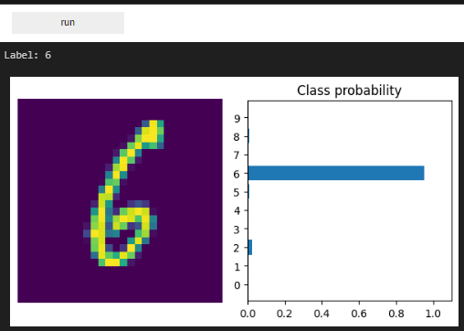

# README

Data on peräisin MNIST-datasetistä, joka sisältää useita käsinkirjoitettuja numeroita.

## script.py
Skripti kouluttaa ja tallentaa neuroverkon, ja käyttää sitä.

`epoch = 5` arvo määrittää, montako kertaa datasetti käydään läpi. Mitä suurempi arvo on, sitä paremmin neuroverkko oppii datasetin

